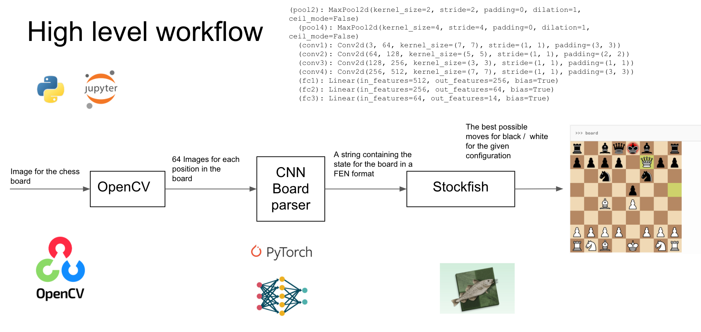
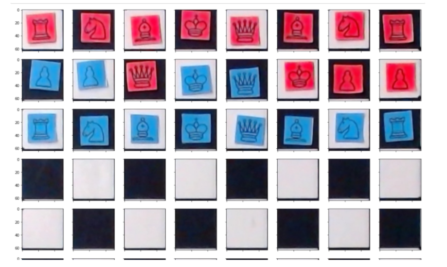
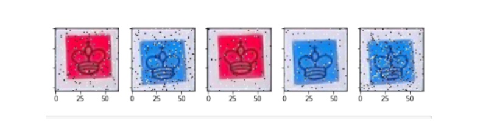
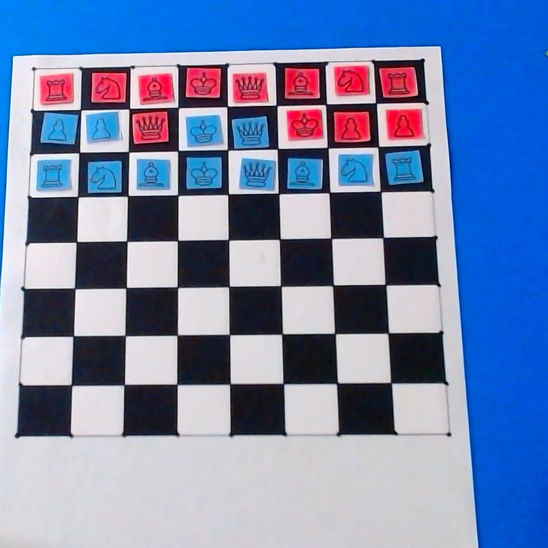
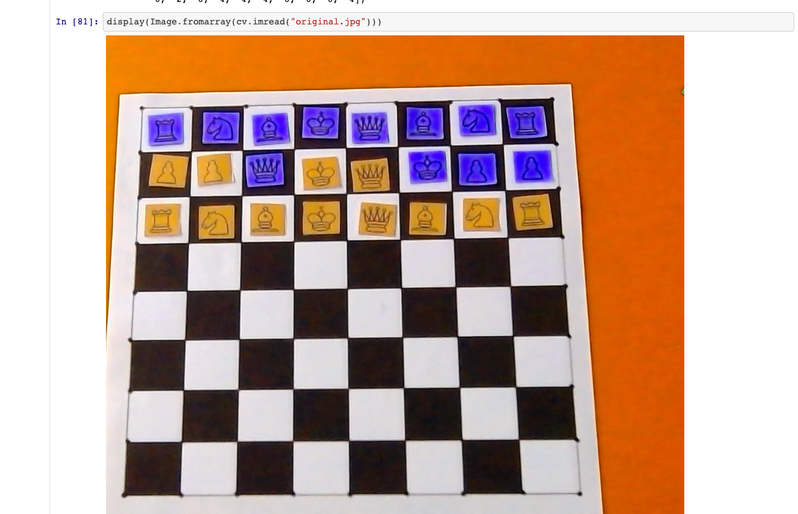
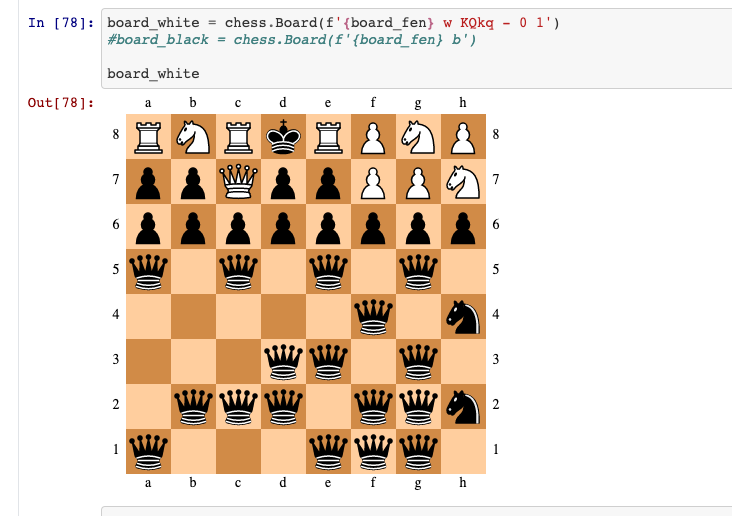

# Chess Master

### *Computer Vision project using OpenCV*

by [Karol Gutierrez](https://github.com/karol22), [Guillermo Herrera](https://github.com/memoherreraacosta), [Juan Quirino](https://github.com/QuirinoC)

---

The objective of this project is to make a 1:1 chess game against a computer using [OpenCV for Python](https://docs.opencv.org/master/) where a camera will detect a chessboard and the game pieces from the upper view. The system will give instructions to the main user to move the pieces in order to keep the game.

The following diagram explains how the model is built using the *image recognition*, *Machine Learning* and *artifitial inteligence using the stockfish engine*:

This process is divided in some steps:

1. Data mining/processing:
   - As a first step, it was used an image classificator to detect the pieces that are involved in the game, the dataset used was built from images taken from a camera, multiple images of each piece and it's player's label (red or blue for this specific case) and multiple backgrounds.
   The result where the following 14 labels `alfil_azul, caballo_azul, fondo_blanco, peon_azul, reina_azul, rey_azul, torre_azul, alfil_rojo, caballo_rojo, fondo_negro, peon_rojo, reina_rojo, rey_rojo, torre_rojo`.

   * Here are some examples of the images taken from the pieces used:
    

   - In order to have a large dataset, we applied multiple transformations as Salt & Pepper filter, rotation, crop and resizing using [PyTorch](https://pytorch.org/) and [OpenCV](https://docs.opencv.org/master/). We collected aprox 32,000 different images as result of these transformations. That dataset is stored in our [AWS S3](https://aws.amazon.com/es/s3/) bucket in order to have scalability in order that the scripts will process the data easier.

    * Here some other examples of the images transformed:
    

    - Some scripts where this process (and further more) can be analyzed, are the following: [Chessboard](https://github.com/karol22/cv-chess-solver/blob/main/Notebooks/chessboard.ipynb), [Split board](https://github.com/karol22/cv-chess-solver/blob/main/Notebooks/split_board.ipynb) and [Model CNN 2](https://github.com/karol22/cv-chess-solver/blob/main/Notebooks/Model_CNN_2.ipynb).

2. Data processing:
    - That dataset was processed in a *Neuronal Network* using the following script [Model CNN](./Notebooks/Model_CNN.ipynb) to get the label's characteristics in order that the classifier will return a model that will be used to identify each board square given. Having this information, the board can be represented in a structure that can be easily processed to get the game's data. The structure that we're using is the [Forsyth–Edwards Notation](https://en.wikipedia.org/wiki/Forsyth%E2%80%93Edwards_Notation0).
    
    - Using this notation we can represent a board as the string: **4t1r1/p1p2pp1/1d1p3p/1P3P2/1P6/2c1D3/PA4PP/4T1R1**

         
  
    - The system will:
        1. Process the video's frames taken from the camera to identify the board to get the data of each square.

        2. Identify each square's value using the model obtained by the classifier.

        3. Once, all the board and their squares are identified, the game will be represented in the [Forsyth–Edwards Notation](https://en.wikipedia.org/wiki/Forsyth%E2%80%93Edwards_Notation0).
        
        4. Having the board represented at this form, using the [Master Chess](https://github.com/karol22/cv-chess-solver/blob/main/Notebooks/Master%20Chess.ipynb) script, it was used to fed an AI analyzer using the [stockfish engine](https://pypi.org/project/stockfish/) from the [chess python](https://python-chess.readthedocs.io/en/latest/) module that will predict the best play for a user. This process was run in a [Google Colab](https://colab.research.google.com/) environment using the power from [CUDA architecture](https://developer.nvidia.com/how-to-cuda-python%20). A result of this process is an instructure to the user to make the computer's move.
   
            

3. Results and visualization:
     - The final result of this project was processed by the [Model CNN](https://github.com/karol22/cv-chess-solver/blob/main/Notebooks/Model_CNN.ipynb) and [Model CNN 2](https://github.com/karol22/cv-chess-solver/blob/main/Notebooks/Model_CNN_2.ipynb) scripts.
      - As a final result, this was the interpretation by the model. This is the original image taken from the video.

        
        
     - This is an image proccesed by the system using [OpenCV](https://docs.opencv.org/master/).
        
    
     - This is the interpretation of the chessboard by the model.
        

     -  We saw that the model has some opportunity areas as:
        - Extend the samples content used to make the data set, we use just a few samples of data to create the transformations.
        - Redesign the classifier in order that will have an architecture more specific for this kind of problems.

**Important**

- [Python 3.8](https://www.python.org/downloads/release/python-380/) (at least) is required.
  
- The script is watching the chessboard in a fixed position, so it needs to be calibrated manually.

- The environment where the project ran was in a [Google colab project](https://colab.research.google.com/notebooks/intro.ipynb) where it was indicated that needed to be set in an enviornment that uses a GPU.

- Feed the data set with multiple and different chessboard pieces images that will be used in the implementation.
